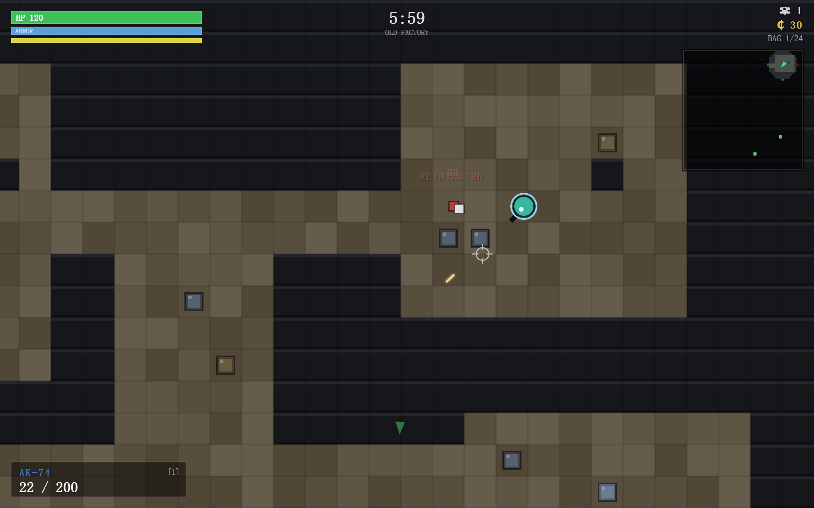
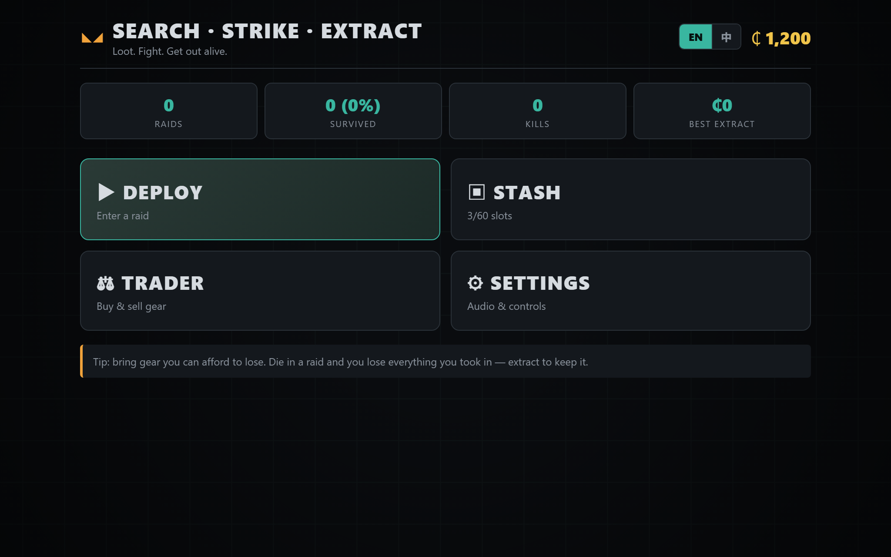
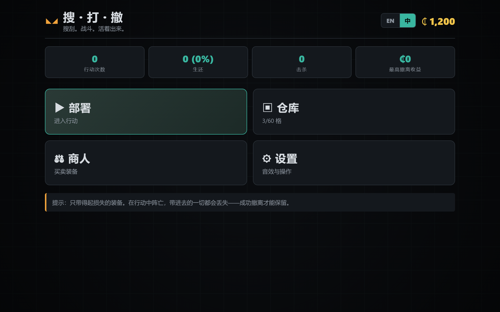

# Search · Strike · Extract — 搜打撤 2D Web Game

A complete, web-based **extraction shooter** (搜打撤: *Search → Fight → Extract*) built in pure
vanilla JavaScript + HTML5 Canvas. No build step, no dependencies, no art/audio asset files
(everything is drawn procedurally and audio is synthesized). Plays on desktop **and** mobile.

> The sea swallowed the old world. Dive the drowned ruins at low tide, salvage what's left,
> fight the Bloom-touched Clawd that roam them, and ride the rising water back up before it seals.
> Go down and you lose everything you brought in *and* everything you found. Surface to keep it.

### ▶ Play it now: **https://zzusp.github.io/search-strike-extract/**

## Screenshots



<p align="center">
  
  
</p>

## Play

Because the game loads its scripts as classic `<script>` tags, it runs by simply opening
`index.html` — but a few browsers restrict `localStorage`/canvas on the `file://` protocol, so
the most reliable way is to serve the folder over HTTP:

```bash
# from this directory
python -m http.server 8080      # then open http://localhost:8080
# or:  npx serve .
```

Open the URL on a phone (same network) to try the touch controls.

## Languages 语言

English and **Simplified Chinese (简体中文)** are both supported. The game defaults to your
browser locale and can be switched live from the **EN / 中** toggle in the menu header, the intro
screen, or Settings — the choice is saved. All strings live in `js/i18n.js` (`G.t(key, params)`
with English fallback; `G.I18n.itemName/locName/enemyLabel/containerLabel/...` localize data
names). Adding another language = add one more block to that catalog.

## Controls

**Desktop** — `WASD`/arrows move · mouse aims · click fires · `R` reload · `E`/`Space` loot ·
`H` heal · `Q` or `1`/`2` swap weapon · `Shift` sprint · `Tab` backpack · `Esc` pause.

**Touch** — left stick moves, right stick aims **and** fires; on-screen buttons for
`SPRINT` (toggle) · `SEARCH` · `RELOAD` · `HEAL` · `SWAP` · `BAG` · pause. HUD respects device
safe-areas (notch / home indicator).

## Story — Coral Tide 珊瑚潮

After the **Great Bleaching**, the rising sea drowned the old-world cities, and the **Bloom** — a
living coral — crept over everything that was left, waking the **Clawd** from its reefs. Most are
feral now. You are a **Tidewalker**: one of the few who can still dive the flooded ruins at low
tide, salvage the old world, and ride the rising water back up before the **Surfacing Vents** seal.
Home is the **Tidepool**, where the old trader **the Conch** pays pearls for relics and keeps a
ledger of favors — a chain of **Contracts** that pull you ever deeper, ending at the **Coral
Tyrant** the Bloom crowned king in the Abyssal Vault.

The fiction reskins the existing mechanics — guns are old-world salvage, the raid timer is the
rising tide, the "scav run" is a borrowed husk-shell — without changing the engine. All names and
lore live in `js/i18n.js` (EN + 简体中文); the questline lives in `js/data.js` + `js/meta.js`.

## The loop

1. **Loadout** — pick a primary/secondary weapon, armor and meds from your cache (deducted on
   deploy), or take the free **Husk Dive** kit. Choose a dive site (3 risk tiers).
2. **Search** — hold to loot crates, lockers, medboxes, weapon racks and safes for relics & arms.
3. **Strike** — Drifters, Reavers and a **Coral Tyrant** boss patrol, hear gunfire, and hunt you.
4. **Extract** — stand in a green ▲ Surfacing Vent and hold position through the countdown.
5. **Cache & the Conch** — bank salvage, trade for pearls, buy better gear, and turn in **Contracts**.

Risk/reward is the core: gear is **removed from your stash on deploy, returned on a successful
extract, and lost on death**. The free Scav kit is the never-broke safety net (it pays a loot
tax so it can't be farmed risk-free).

## Project structure

```
index.html          # entry; loads scripts in dependency order + safe-area probe
css/style.css       # UI theme, responsive, safe-area aware
js/core.js          # engine: utils, seeded RNG, input (kbd/mouse/touch), audio synth, particles, camera
js/data.js          # item database, balance config, loot/enemy tables, locations, shop
js/world.js         # procedural map gen, tile collision, LOS raycast, A* pathfinding, bullets
js/entities.js      # Player + Enemy AI (vision/hearing, patrol→alert→combat→search)
js/meta.js          # save (localStorage), profile, stash, economy, loadout lifecycle
js/raid.js          # in-raid controller: simulation, rendering, HUD, mobile controls
js/ui.js            # DOM screens: intro, hub, deploy, loadout, stash, trader, settings, results
js/main.js          # state machine, render loop, canvas/DPR sizing, host wiring
tools/smoke.js      # Node smoke-test harness (stubs the browser, runs the game headless)
```

## Testing

```bash
node tools/smoke.js
```

Stubs the DOM/canvas/localStorage, loads every module, and exercises map generation, a full
combat raid, looting, extraction, death, the economy, every UI screen, the mobile touch HUD,
corrupt-save recovery, and a 20-raid stress run.

## Mini-game platform packaging

- **Self-contained & offline**: no network requests, no external assets, no fonts to load — just
  HTML/CSS/JS. Zip the folder and upload.
- **Single canvas, full-viewport**, renders at `devicePixelRatio` (capped at 2) for crisp output
  on retina/mobile while keeping logical CSS-pixel coordinates.
- **Robust**: the render loop has an error boundary (a thrown frame can never freeze the game),
  global `error`/`unhandledrejection` handlers recover to the hub, corrupt saves are sanitized,
  and the game auto-pauses when the tab is hidden.
- **Persistence** via `localStorage` (key `searchstrike_save_v1`), with a private-mode fallback.
- **Audio** is unlocked on first interaction and resumed on tab return (browser autoplay policy).
- To re-skin for a specific SDK (e.g. WeChat/抖音 mini-game, Poki, CrazyGames), wrap the canvas in
  the platform shell and forward its lifecycle pause/resume to `Game.raid.paused`.

## License / attribution

Original game and code. Audio is generated with the Web Audio API; all visuals are drawn at
runtime — there are no third-party assets to attribute.
